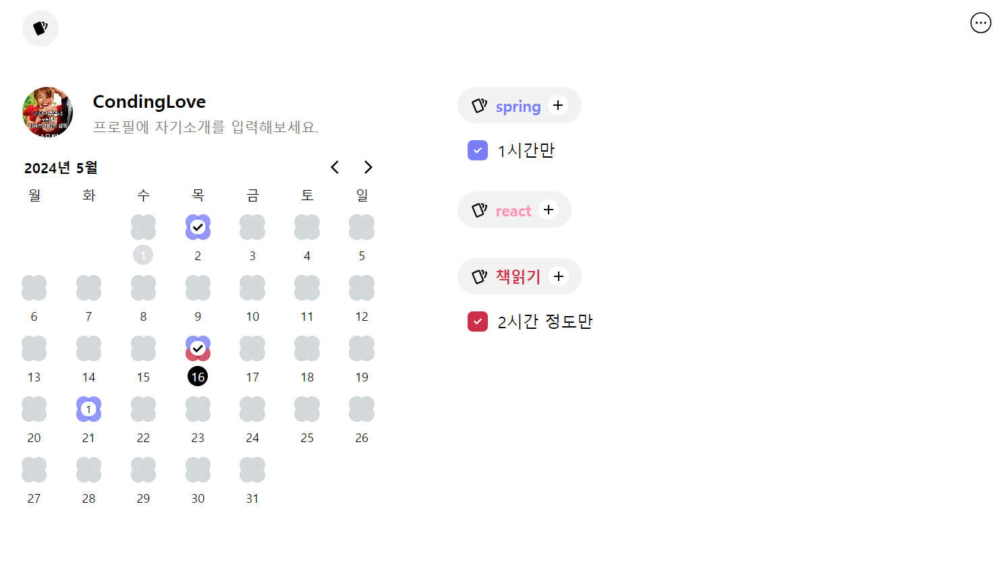

# 투두메이트 클론코딩

충남대 멋쟁이사자처럼 12기 정기세션 최종과제 예정

## 스크린샷

## 초기 구현 (백엔드 api 연동전)

- mockData로 UI 구현 완성
- 특정 달에 해당하는 투두리스트를 받아와 클라이언트에서 필터링 (recoil selector 활용)
- api 연동시 비동기 작업을 위해 selector 활용 예정
- api 수정 요청
